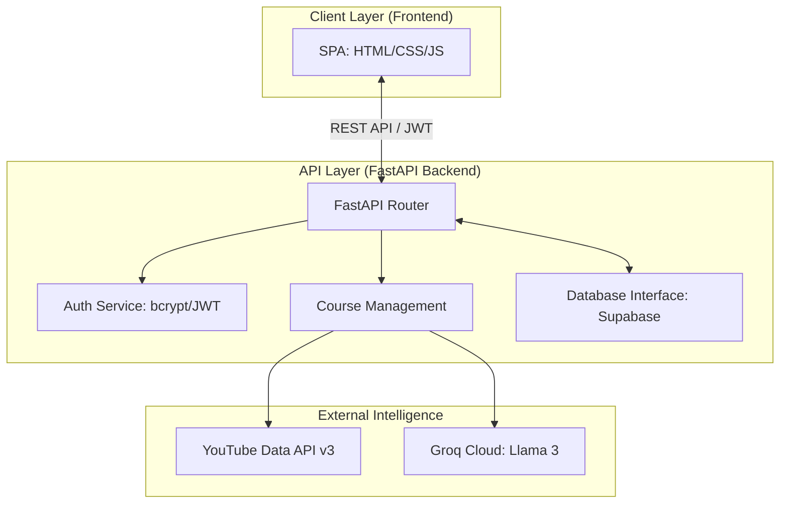
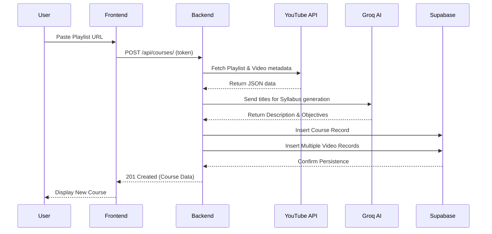
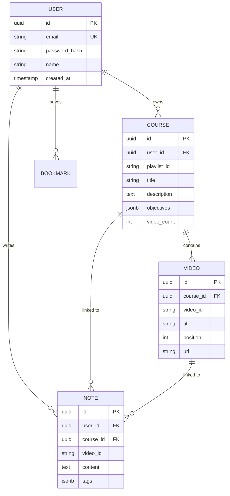

# 🎓 LMS Suite: Your Distraction-Free Learning Sanctuary

**Escape the YouTube noise. Build your own library. Master your skills.**

LMS Suite is a high-performance, distraction-free environment that transforms YouTube playlists into structured educational courses.

---

## 🔗 Live Deployments

| Component | URL |
| :--- | :--- |
| **🚀 Frontend Application** | [https://abmlms.wasmer.app/](https://abmlms.wasmer.app/) |
| **⚙️ Backend API** | [https://abm-111-abmlms.hf.space](https://abm-111-abmlms.hf.space) |

---

## 🏗️ Accurate Project Architecture

### 1. System Components Diagram
This diagram illustrates the high-level interaction between the client, the server, and external integrations.

### 2. Sequence Diagram: Course Import Workflow
This UML sequence diagram accurately tracks the logic flow when a user converts a YouTube playlist into a course.

### 3. Database UML (Entity Relationship)
The underlying data structure is optimized for fast lookups and relational integrity.

---

## 🌟 The Philosophy: Learning Without the Noise

YouTube is designed to keep you clicking. **LMS Suite** is designed to keep you learning.

*   **Extraction:** We pull the core educational value (the videos) out of the social media noise.
*   **Isolation:** We provide a clean interface where the only thing on your screen is your lesson and your notes.
*   **Retention:** By using **Markdown Notes** and **AI-generated Objectives**, we help you move from passive watching to active mastery.

---

## 🛠️ Tech Stack & Technical Details

### Backend
- **Framework**: FastAPI (Asynchronous Python)
- **Security**: JWT tokens, bcrypt-sha256 hashing.
- **AI**: Groq (Llama 3.1 70B) for instant syllabus generation.
- **Database Client**: Patched `httpx` for reliable Supabase connectivity.

### Frontend
- **Architecture**: Single Page Application (SPA).
- **Styling**: Vanilla CSS (Flexbox/Grid).
- **State**: Centralized `APP` object managing auth and navigation.

---

## 🚀 Get Started

1.  **Register:** At [abmlms.wasmer.app](https://abmlms.wasmer.app/).
2.  **Import:** Paste your favorite YouTube Playlist URL.
3.  **Master:** Take notes, save bookmarks, and build your resource library with **Lifetime Access**.

---

### 🤝 Reclaim your focus.
*LMS Suite: Designed for those who take learning seriously.*

Built with ❤️ by **[Abdul Basit](https://www.engrabm.com)**
